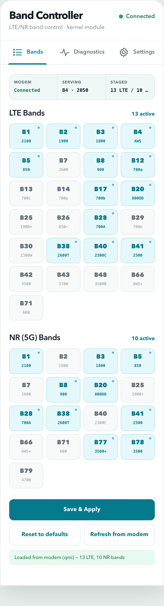
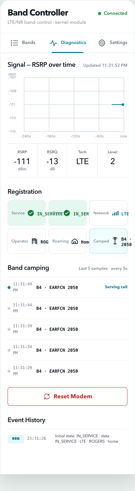

# Band Controller

A standalone KernelSU module for LTE/NR band control and modem diagnostics on Qualcomm devices — no third-party apps required (Network Signal Guru is not needed).

## Download

**v1.6 release asset (recommended):**

- Direct download: [bandctl-v1.6.zip](https://github.com/raz123/bandctl/releases/download/v1.6/bandctl-v1.6.zip)
- SHA-256: `53d9ce054b176a96b9702ccea2e2f676d224fec3acc1146a92a48ede3288c499`
- Size: ~6.5 MB
- Release page: [Band Controller v1.6 — bundled Python runtime, no Termux](https://github.com/raz123/bandctl/releases/tag/v1.6)

**What's new in v1.6:** bundled Python runtime (no Termux needed) and boot auto-start before first unlock.

Older versions: see [GitHub Releases](https://github.com/raz123/bandctl/releases).

## Requirements

- **Root**: KernelSU (or KernelSU-compatible) root.
- **Device**: A Qualcomm modem device (tested on Poco F3 / alioth).
- **No dependencies** — the module ships a bundled Python runtime; Termux is not required.

## Install

1. Download [bandctl-v1.6.zip](https://github.com/raz123/bandctl/releases/download/v1.6/bandctl-v1.6.zip) to your device.
2. Open the **KernelSU app** → **Modules** → **Install from storage** and pick the zip.
   - Alternatively, from a root shell: `ksud module install bandctl-v1.6.zip`
3. Reboot (or let the module start the service).
4. Open the web UI:
   - **KernelSU Manager WebUI** — open the module in KernelSU/ReSukiSU Manager and tap the launch button (or open `ksu://webui/bandctl` directly). The UI is served from inside the Manager and the API calls reach the module's python server at 127.0.0.1:8080 (loopback cleartext is allowed by the Manager). Works out of the box — no extra setup.
   - **Browser** — open **http://localhost:8080** from the device browser.
   - From a computer: `adb forward tcp:8080 tcp:8080`, then open http://localhost:8080.

## Screenshots

The v1.6 web UI: 13 LTE bands active, and live diagnostics (RSRP/RSRQ, registration chips, signal graph).





## Features

- **7 API endpoints**:
  - `GET  /api/read` — current LTE/NR band configuration (from QMI, diag, config file, or default)
  - `POST /api/write` — write LTE/NR band configuration to the modem (QMI first, diag fallback)
  - `GET  /api/signal` — current signal strength (RSRP/RSRQ/level) from `dumpsys telephony.registry`
  - `GET  /api/registration` — service/data state, network type, operator, roaming
  - `GET  /api/health` — transport status (QMI or diag, band counts, diag session owner)
  - `POST /api/modem-reset` — soft modem reset (`cmd phone radio power` off/on, with fallback)
  - `GET  /api/band-camping` — live band-camping log: last N serving-cell EARFCN/band samples
- **Live band-camping log** — the module records serving-cell EARFCN/band samples so you can see whether a forced band actually stuck.
- **RSRP graph UI** — the web UI plots signal strength over time.
- **Config persistence** — band settings are mirrored to `/data/adb/modules/bandctl/config/bands.json` and survive reboots.
- **KernelSU Manager WebUI** — after install, open the module in KernelSU/ReSukiSU Manager and tap the launch button (or open `ksu://webui/bandctl`); the UI also still works at http://localhost:8080.

## How it works

- **Bundled Python runtime** — the web server runs on the Python interpreter shipped inside the module (`python/bin/python3.14` with its stdlib and shared libraries under `python/`), so no Termux install is needed and the service starts before first unlock.
- **Direct QMI band apply over QRTR** via the bundled static `qmi_band` client (source in `qmi/`). It discovers the live NAS endpoint at runtime (service/node/port are probed, not hardcoded), reads the current band configuration, and applies LTE/NR band preference changes — the modem camps per the applied list.
- **`/dev/diag` fallback** via the bundled pure-Python protocol stack (the diag kernel driver, feature masks, and NV/band-mask commands) for devices where diag works.
- **Telephony-framework monitoring** via `dumpsys telephony.registry` — signal strength, registration state, and band camping are reported regardless of transport.
- **Graceful fallback chain** — reads try QMI, then diag, then the config file; writes try QMI, then diag, and always mirror intent to `config/bands.json`.

## Status and honest limitations

**QMI band apply works on this device (Poco F3 / alioth).** Forcing bands via the web UI moved camping off band 4 (EARFCN 2050) onto band 12 (EARFCN 5060) in ~40s, and restoring the Rogers config moved it back toward band 4 with registration IN_SERVICE. `/api/read` reports the live QMI band state with `source: "qmi"`.

Where the QRTR QMI service is unavailable, the module falls back to `/dev/diag` — on kernels where the diag feature-mask handshake never completes, band **writes** may be NACKed. In every case band intent is mirrored to the config file and monitoring keeps working.

## Band configuration

Default config (`config/bands.json`):

```json
{
  "lte": ["1", "2", "3", "4", "5", "8", "12", "17", "20", "28", "38", "40", "41"],
  "nr": ["1", "3", "5", "8", "20", "28", "38", "41", "77", "78"]
}
```

Bands **6, 7, and 66 are intentionally absent/disabled** — this is a community-validated fix for Canadian carriers: enabling them causes Telus/Koodo/Rogers to drop network reports. Edit `/data/adb/modules/bandctl/config/bands.json` (or use the web UI) to customize.

## Development / testing

- Tested on: **Poco F3 (alioth)**, **ArrowOS 13.1**, kernel **4.19.325-cip130**.
- Protocol tests: **27/27 passing**.
- The repo contains the complete module source: `customize.sh` (installer), `service.sh` (boot service), `web/` (pure-stdlib Python HTTP server + UI), `webroot/` (KernelSU Manager WebUI), `diag/` (pure-Python diag protocol stack), `qmi/` (the QRTR QMI band client — `qmi_band.c` + Makefile, built static for aarch64 with musl; only the binary ships in the module zip), `python/` (bundled Python 3.14 runtime, shipped in the zip), and `config/bands.json` (default band config).

## License

[MIT](LICENSE) © 2026.
